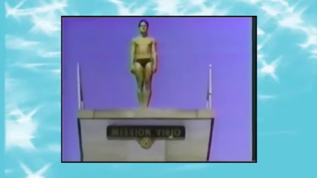

# centered-object-video
This places an object (video, image, svg) in the middle of a video. There is a setting that also allows the user to change the background to a color, image, or video.



## Example Usage

```
python blend__video.py \
  --audio-input="media/video"
  --object-input="media/image" \
  --background-color="#fff" \
  --object  -width="600" \
  --aspect-ratio="1280x600" \
  --vid-duration="(30,60)" \
  --opacity=".4" \
  --output-dir="output" \
 &&
 ```

 ## Arguments

`--audio-input=" "`

Can accept either directories (will choose one file at random) or a specific file.

**Allowed files:** .wav, .mp3, .flac

`--object-input=" "`

Can accept either directories (will choose one file at random) or specific files.

`--object-width=" "`

Controls the object width.

`--aspect-ratio=" "`

Lets you set the size of the outputted video.

Here's a good list of recommended sizing and aspect ratios. https://support.brightcove.com/en/video-cloud/docs/optimal-video-dimensions

`--vid-duration=" "`

Duration of the outputted video. This will be treated in seconds. You can write a single, definitive number ( eg. `45`) or a range that will be randomly selected when run (eg. `(30,60)`).

`--background-color=" "`

The background color of the video. Accepts Hex or RGBA values. Setting this value as null makes the background transparent.

`--background-video=" "`

Allows you to place a secondary video in the background. By default it should fill the screen entirely.

`--opacity=" "`

Opacity of the centered object.

`--output-dir=" "`

The directory that the completed thing will output to.

## Development Notes
- Not sure how reusable it is, but a previous script I designed uses this pattern: https://github.com/luismqueral/jumpcityrecords
- Each sound thats blended should be panned left right and center, repeating if there are more than three. L and R panning amounts should not be "hard" (panned 100%), let's figure out a way to make them range from 30%-80%.
- The audio library `SoX` will probably be best for this - http://sox.sourceforge.net/
- Here's a relevant stack overflow i found: https://video.stackexchange.com/questions/12105/add-an-image-in-front-of-video-using-ffmpeg

## Boilerplate
```
# Centered Object
# //////////////////////////////
echo "Run centered-object-video"

python blend__video.py \
  --audio-input="path/to/audio" \
  --object-input="path-to-object" \
  --object-width="  " \
  --background-input="  " \
  --background-width="  " \
  --aspect-ratio="  " \
  --vid-duration="  " \
  --opacity=" " \
  --output-dir="path/to/output" \
 &&
 ```
